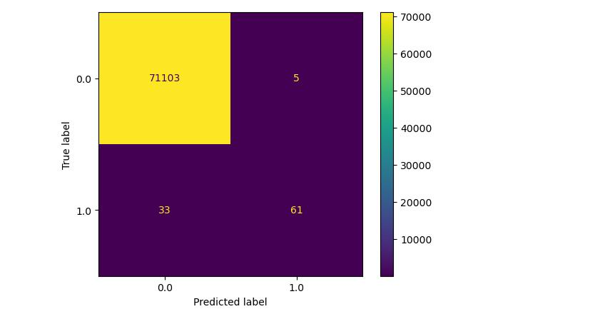
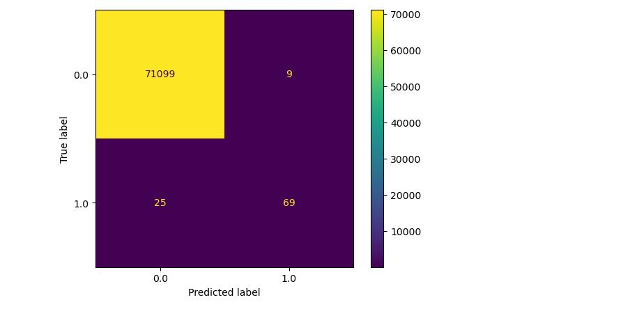

# Decision Trees for Fraud Detection

## NON-TECHNICAL EXPLANATION OF PROJECT
This project takes 284k rows of credit card transaction data and builds a decision tree which attempts to classify the transactions as fraudulent or not. Fraud identification is important in many industries and situations, including credit card companies, forensic accountants, and financial statement audits. In reality, the person identifying the fraud will have historic data and be trying to identify fraud in real time (e.g. credit card company trying to prevent fraudulent transactions going through), or try to identify any or further instances of fraud in a financial ledger (for example forensic accountants or auditors). Fraud datasets are by their nature very unbalanced, as there are (hopefully, at least) many times more non-fraudulent transactions than fraudulent. In addition, it is often important to be able to justify decisions on whether to investigate a transaction to stakeholders, for example to understand why a fraud was missed or to explain why a particular transaction is being looked in to. Therefore, decision trees present an excellent option for a machine learning classifier, as they can be relatively easily interpreted and understood. 

## DATA
The dataset used is 284,807 credit card transactions, including 492 fraudulent ones. The data was obtained from Kaggle (https://www.kaggle.com/datasets/mlg-ulb/creditcardfraud). It was originally collected and analysed during a research collaboration of Worldline and the Machine Learning Group (http://mlg.ulb.ac.be) of ULB (Université Libre de Bruxelles) on big data mining and fraud detection.

The citations on the Kaggle website, within the acknowledgements were as follows:

Andrea Dal Pozzolo, Olivier Caelen, Reid A. Johnson and Gianluca Bontempi. Calibrating Probability with Undersampling for Unbalanced Classification. In Symposium on Computational Intelligence and Data Mining (CIDM), IEEE, 2015

Dal Pozzolo, Andrea; Caelen, Olivier; Le Borgne, Yann-Ael; Waterschoot, Serge; Bontempi, Gianluca. Learned lessons in credit card fraud detection from a practitioner perspective, Expert systems with applications,41,10,4915-4928,2014, Pergamon

Dal Pozzolo, Andrea; Boracchi, Giacomo; Caelen, Olivier; Alippi, Cesare; Bontempi, Gianluca. Credit card fraud detection: a realistic modeling and a novel learning strategy, IEEE transactions on neural networks and learning systems,29,8,3784-3797,2018,IEEE

Dal Pozzolo, Andrea Adaptive Machine learning for credit card fraud detection ULB MLG PhD thesis (supervised by G. Bontempi)

Carcillo, Fabrizio; Dal Pozzolo, Andrea; Le Borgne, Yann-Aël; Caelen, Olivier; Mazzer, Yannis; Bontempi, Gianluca. Scarff: a scalable framework for streaming credit card fraud detection with Spark, Information fusion,41, 182-194,2018,Elsevier

Carcillo, Fabrizio; Le Borgne, Yann-Aël; Caelen, Olivier; Bontempi, Gianluca. Streaming active learning strategies for real-life credit card fraud detection: assessment and visualization, International Journal of Data Science and Analytics, 5,4,285-300,2018,Springer International Publishing

Bertrand Lebichot, Yann-Aël Le Borgne, Liyun He, Frederic Oblé, Gianluca Bontempi Deep-Learning Domain Adaptation Techniques for Credit Cards Fraud Detection, INNSBDDL 2019: Recent Advances in Big Data and Deep Learning, pp 78-88, 2019

Fabrizio Carcillo, Yann-Aël Le Borgne, Olivier Caelen, Frederic Oblé, Gianluca Bontempi Combining Unsupervised and Supervised Learning in Credit Card Fraud Detection Information Sciences, 2019

Yann-Aël Le Borgne, Gianluca Bontempi Reproducible machine Learning for Credit Card Fraud Detection - Practical Handbook

Bertrand Lebichot, Gianmarco Paldino, Wissam Siblini, Liyun He, Frederic Oblé, Gianluca Bontempi Incremental learning strategies for credit cards fraud detection, IInternational Journal of Data Science and Analytics

## MODEL 
I used a decision tree model because I was primarily concerned with building a model which was interpretable and would allow the user to justify the decision making and explain it to the varying stakeholders.

## HYPERPARAMETER OPTIMSATION
The hyperparameters which were optimised were the max depth of the decision tree, in order to avoid over-fitting, which is common in decision trees, and the class weights which were applied to reduce the impact of imbalance on the model.

They were optimised using grid search, by calculating every combination of max depth (from 1 to 10) and a small set of weights (weighting the 0 class by 0.1 intervals from 0.1 up to 0.5, plus the "balanced" weighting which would fully balance the dataset). There were two models taken forwards to testing based on two different criteria.

Model 1: the best F1 score based on mean across 5-fold cross validation.

Model 2: the best recall, but with a minimum precision of 80%, again both based on mean across 5-fold cross validation.

## RESULTS

Model 1 confusion matrix on test data:

Model 1 had a test precision of 0.924, test recall of 0.649, and F1 score of 0.763

Model 2 confusion matrix on test data:

Model 2 had a test precision of 0.885, test recall of 0.734, and F1 score of 0.802

Given the potentially very high cost of false negatives compared to false positives, overall Model 2 appears to have the best generalised performance. Depending on the risk appetite of the user, it may be better to train a more conservative model (for example reduce precision threshold to 70%), as in later data false negative rate may increase due to data drift and new patterns in fraud which the model would not have been trained on.
